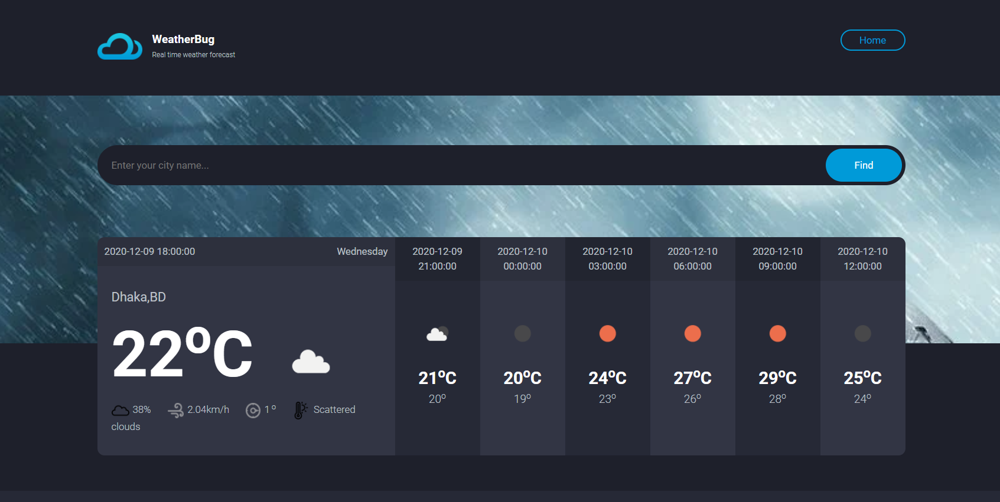

Weathercast Using Python and Django 
*Weather Bug is the application of science and technology to predict the conditions of the atmosphere for a given location and time. You can get the realtime Weather forecasting by using this web application*

Tea

   
1.  Create `venv` virtual environment:
```bash
pip install venv virtual

# Screenshots of the Project
<p align="center">
  
  
</p>

[Click here to open the Weathercast Website](http://127.0.0.1:8000/ )

